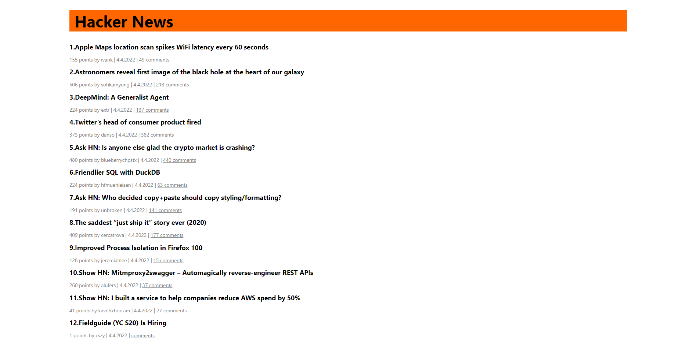

# Hacker News 

Build the front page of HN using TypeScript and ReactJS. https://news.ycombinator.com/ 

Like on Hacker News: 
- Show the top stories homepage, along with the number of votes for each story 
- Clicking on story titles should follow the story link 
- Include the comments link at the bottom of each story 
- Clicking the comments link should show the comments on the story 

# Rules

- Don't spend more than 3 hours on this exercise 
- Application code cannot have any dependency other than React.js, so don't use Redux or Mobx 
- Use React Hook components and don't use class-based components 
- It's OK to use builders like create-react-app 

# Stack Technologies

- React
- Typescript
- Hacker News API

# Testing

To test the application, you need to enter the following commands:

You need to clone the repository using the command:`git@github.com:ToxichQQQ/hacker-news.git`

After the repository has been copied, go to the repository and run the `npm install` command.

Start the application using the `npm start`

# Thanks for your attention

You can contact me by this email storozhenko.dev@gmail.com
